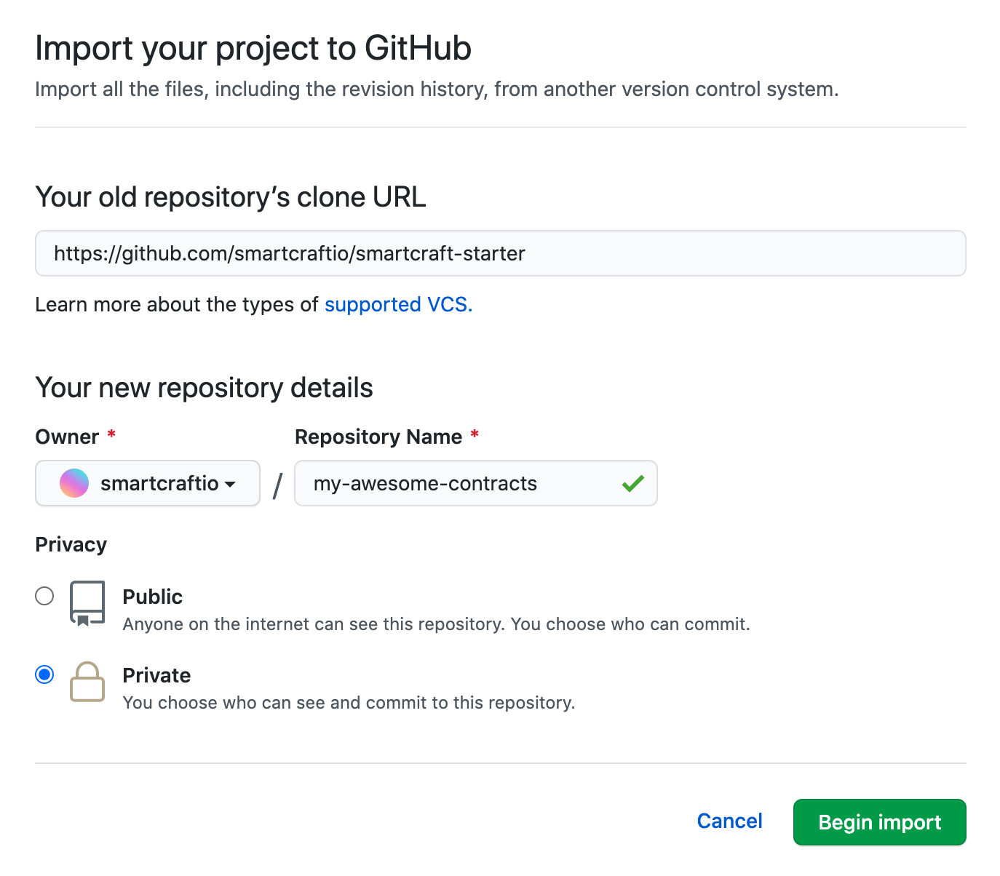
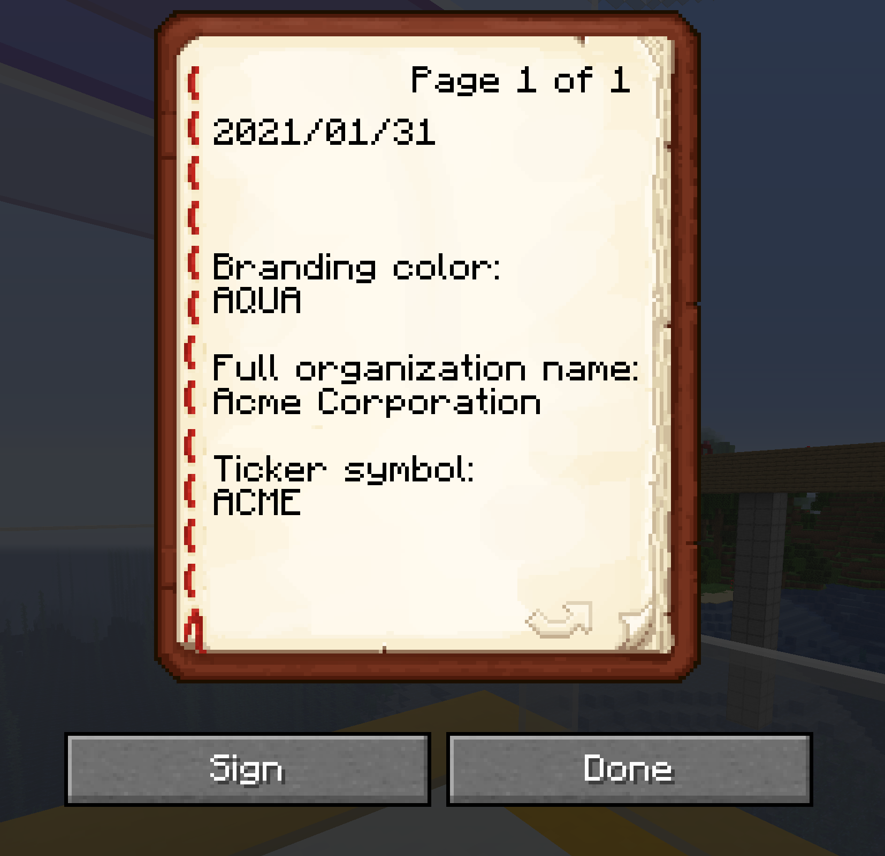

# smartcraft smart contract starter

[Smartcraft](https://smartcraft.io/) has a proprietary smart contract system
where players can write code to manipulate the game economy and Minecraft world
(with tight security permissions).

## Create a private fork of this starter
1. Go to https://github.com/new/import
2. Fill out the input fields (see image below for example)

## GitHub codespaces setup (easy development in the browser)
1. Join the beta of GitHub codepsaces: https://github.com/features/codespaces
2. Receive access to the beta
3. Create a private fork
4. Go to https://github.com/codespaces and click on `New codespace`
5. Select your private fork
6. In the terminal on the bottom half of the screen, run the terminal command `./installDependencies.sh`

## Code environment setup (local development)
If you are on Windows, you first need to install Git Bash and [Chocolatey](https://chocolatey.org/). Alternatively, you can use codespaces for easy setup.

1. Install `deno`: https://deno.land/manual/getting_started/installation
2. (on VS Code) Install the deno VS Code extension: https://marketplace.visualstudio.com/items?itemName=denoland.vscode-deno
3. (optional but recommended) Install [Node Version Manager](https://github.com/nvm-sh/nvm), open a new terminal, and run `nvm install stable` to install the latest Node.js
4. In your terminal, run the command `./installDependencies.sh`
5. Clone this repository into your own (recommended private) repository

## In-game setup
1. Go to the DMV near spawn and buy an `Articles of Incorporation`
2. Incorporate your company and pick a clever ticker symbol (1-6 letters)
3. In game, press `t` to open up the chat and run the command `/api`
4. Click on your api key to populate the chat bar with the api key
5. Select all and copy the api key to your clipboard and save it somewhere. If you lose it, you can always retrieve it again using the `/api` command.

## Uploading a contract
The upload tool included in this repository is an interactive terminal tool to
upload your smart contract to production.
1. This repository contains starter smart contracts in `contracts/` to get you started.  Copy `contracts/EXAMPL.ts` to `contracts/TICKER.ts` (replacing `TICKER` with the ticker symbol of your in-game organization).
2. (the slow way) Use the command `./upload.sh` to trigger one upload.
3. (the cool way) Use the command `./nodemonUpload.sh` to upload once and continue to automatically watch for local changes that trigger more uploads.
4. Follow the instructions given by the upload tool (which will automatically create a `smartcraft.config.json` file).
5. Develop with feedbakc from the messages that are sent to both your terminal and in-game.

## Reference and API Docs
There are three sources of reference to you as a smart contract developer:
- [smartcraft API docs](https://smartcraft.io/api-docs): web documentation generated from `scioTypes.ts` and `ContractBase.ts`
- [`scapi/scioTypes.ts`](https://github.com/smartcraftio/smartcraft-starter/blob/master/scapi/scioTypes.ts): contains all the typescript types used in events as well as the source to `this.API` (do not make changes to this, it will not get uploaded)
- [`scapi/ContractBase.ts`](https://github.com/smartcraftio/smartcraft-starter/blob/master/scapi/ContractBase.ts): the abstract class that your contract is based off (do not make changes to this, it will not get uploaded)

## Updating your forked repository (via the mergeUpdates.sh)
1. Save and commit all your changes locally.
2. Run the update script using the command `./mergeUpdates.sh` (which will perform a git merge with this public repository)
3. Fix any git merge conflicts that exist. To do this, use the git tools on the sidebar.
4. Use `git add` on all the files that you fixed merge conflicts on (if any)
5. If you are in the interactive rebase state, use `git merge --continue` to continue, or `git merge --abort` to undo the whole merge process.

## Closed source components
Currently, it is only possible to test in production because the
SCVirtualMachine is not included in this repository. However, as it matures, it
may be released and you will be able to test locally and set up continuous
integration.

Meanwhile, uploading to production is already a great experience, since all
error messages are piped back to you in the terminal and also in the in-game
chat. If you want to develop a contract separate from the production contract, you can
create a test organization in-game and develop against the test organization until you
are ready to push to the production organization.